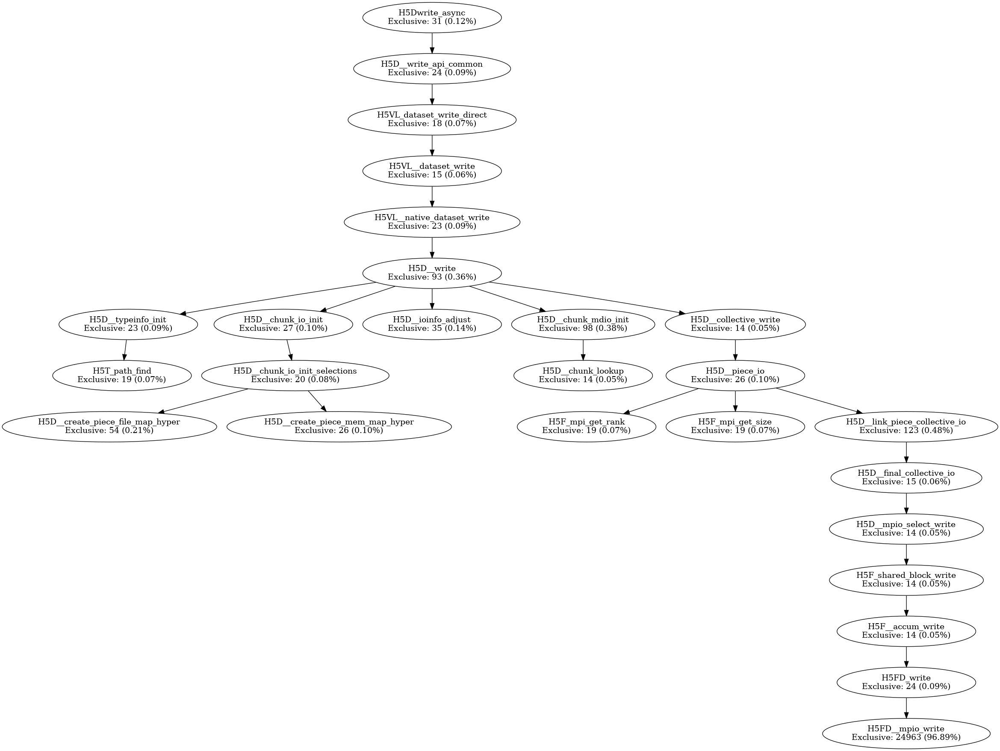
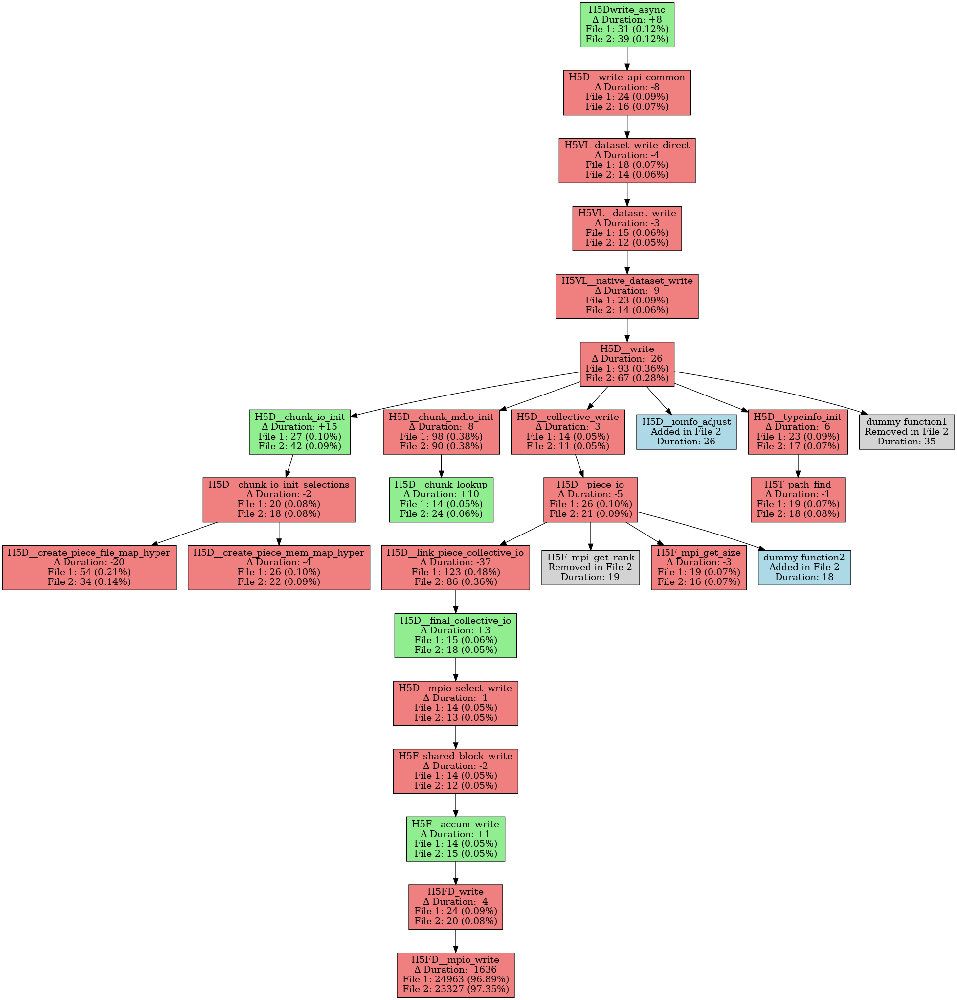

=========================
Application Integration
=========================

DataCrumbs provides multiple methods for integrating tracing into your applications without requiring source code modifications.

Integration Methods
===================

DataCrumbs supports three primary integration methods:

1. **Binary Tracking** (``datacrumbs_track``): Permanently modify executable to include tracing **(Recommended)**
2. **LD_PRELOAD Wrapping** (``datacrumbs_wrap``): Dynamically inject tracing at runtime
3. **Wrapper Mode** (``datacrumbs_run``): Automatic tracing with server management

.. note::
   **Binary tracking is recommended** for most use cases. Tracked applications run normally when DataCrumbs is not active - they simply don't capture trace data. When the DataCrumbs server is running, data is automatically captured.

Each method has different use cases and trade-offs.

Method 1: Binary Tracking (Permanent)
======================================

Binary tracking uses ``patchelf`` to permanently add DataCrumbs client library as a dependency of your executable.

When to Use
-----------

**Recommended for most use cases:**

- Applications you want traced every time they run
- Production deployments
- Applications that run frequently
- Long-running applications or daemons
- Scenarios where LD_PRELOAD is problematic
- Setuid/setgid binaries

**Key benefit**: Tracked applications run normally when DataCrumbs is not active. When the server is running, data is captured automatically. When it's not running, the application executes with no tracing overhead.

How It Works
------------

``datacrumbs_track`` modifies the ELF binary to add ``libdatacrumbs_client.so`` to the ``DT_NEEDED`` entries. The library is automatically loaded when the application starts.

Tracking an Application
-----------------------

**Command Reference:**

.. code-block:: bash

    datacrumbs_track --executable PATH [OPTIONS]

**Arguments:**

``--executable PATH``
    Path to the executable to instrument (required)

**Common Options:**

``--verbose``
    Enable detailed output showing each step of the tracking process

``--quiet``
    Suppress informational messages

``--dry-run``
    Show what would be done without modifying the binary

**Examples:**

.. code-block:: bash

    # Track a local binary
    datacrumbs_track --executable ./myapp

    # Track with verbose output
    datacrumbs_track --executable ./myapp --verbose

    # Dry-run to see what would happen
    datacrumbs_track --executable ./myapp --dry-run

    # Track a binary in PATH
    datacrumbs_track --executable $(which python3)

    # Track with absolute path (quiet mode)
    datacrumbs_track --executable /usr/local/bin/simulation --quiet

Verification
------------

Verify the executable is tracked:

.. code-block:: bash

    # Check for DataCrumbs library dependency
    ldd ./myapp | grep datacrumbs

    # Should show:
    # libdatacrumbs_client.so => /path/to/lib/libdatacrumbs_client.so

Using Tracked Applications
---------------------------

Once tracked, the application is automatically traced whenever it runs (if the DataCrumbs server is active):

.. code-block:: bash

    # Start server
    sudo datacrumbs_server_run.sh

    # Run tracked application normally
    ./myapp arg1 arg2

    # Application is automatically traced
    # Traces saved to $DATACRUMBS_TRACE_DIR

Untracking an Application
--------------------------

Remove DataCrumbs instrumentation from a binary:

**Command Reference:**

.. code-block:: bash

    datacrumbs_untrack --executable PATH [OPTIONS]

**Arguments:**

``--executable PATH``
    Path to the executable to uninstrument (required)

**Common Options:**

``--verbose``
    Enable detailed output

``--quiet``
    Suppress informational messages

``--dry-run``
    Show what would be done without modifying the binary

**Examples:**

.. code-block:: bash

    # Untrack a binary
    datacrumbs_untrack --executable ./myapp

    # Untrack with verbose output
    datacrumbs_untrack --executable ./myapp --verbose

    # Dry-run to verify before untracking
    datacrumbs_untrack --executable ./myapp --dry-run

    # Verify removal
    ldd ./myapp | grep datacrumbs
    # Should show no output

Important Considerations
------------------------

**Backup Your Binaries**

Always keep a backup before tracking:

.. code-block:: bash

    cp myapp myapp.original
    datacrumbs_track --executable myapp

**Permissions**

You need write permission on the binary:

**Library Path**

Ensure ``libdatacrumbs_client.so`` is in the library path:

.. code-block:: bash

    # Add to LD_LIBRARY_PATH
    export LD_LIBRARY_PATH=/path/to/datacrumbs/lib:$LD_LIBRARY_PATH

    # Or use module
    module load datacrumbs/0.0.4

**Binary Compatibility**

- Works with dynamically linked executables
- Does not work with static binaries
- May not work with binaries that check their own integrity

Method 2: LD_PRELOAD Wrapping (Dynamic)
========================================

LD_PRELOAD wrapping dynamically injects the DataCrumbs client library without modifying the binary.

When to Use
-----------

- One-time or ad-hoc tracing
- Testing DataCrumbs before permanent tracking
- Binaries you cannot modify
- Applications where binary modification is undesirable
- System binaries or read-only executables

How It Works
------------

``datacrumbs_wrap`` sets ``LD_PRELOAD`` to load ``libdatacrumbs_client.so`` before executing your application. The library intercepts I/O calls at runtime.

Wrapping an Application
-----------------------

**Command Reference:**

.. code-block:: bash

    datacrumbs_wrap COMMAND [ARGS...]

**Arguments:**

``COMMAND``
    Command to execute with tracing

``ARGS``
    Arguments to pass to the command

**Examples:**

.. code-block:: bash

    # Wrap a simple command
    datacrumbs_wrap ./myapp input.dat

    # Wrap with multiple arguments
    datacrumbs_wrap python3 analysis.py --input data.csv --output results.txt

    # Wrap a pipeline
    datacrumbs_wrap bash -c "cat file.txt | ./process > output.txt"

    # Wrap with environment variables
    datacrumbs_wrap env VAR=value ./myapp

Using with Server
-----------------

For LD_PRELOAD wrapping to work, the DataCrumbs server must be running:

.. code-block:: bash

    # Start server
    sudo datacrumbs_server_run.sh

    # Wrap and run application
    datacrumbs_wrap ./myapp

    # Stop server when done
    sudo datacrumbs_server_stop.sh

Manual LD_PRELOAD
-----------------

You can also manually set LD_PRELOAD:

.. code-block:: bash

    # Set LD_PRELOAD
    export LD_PRELOAD=/path/to/lib/libdatacrumbs_client.so

    # Run application
    ./myapp

    # Unset when done
    unset LD_PRELOAD

Important Considerations
------------------------

**Security Restrictions**

LD_PRELOAD is ignored for setuid/setgid binaries for security reasons:

.. code-block:: bash

    # This won't work if myapp is setuid
    datacrumbs_wrap /usr/bin/setuid_app

**Environment Inheritance**

Child processes inherit LD_PRELOAD:

.. code-block:: bash

    # All processes in the pipeline are traced
    datacrumbs_wrap bash -c "./step1 | ./step2 | ./step3"

**Library Conflicts**

Some applications may conflict with LD_PRELOAD:

.. code-block:: bash

    # If application checks LD_PRELOAD
    # Use track method instead

**Performance**

LD_PRELOAD adds minimal overhead compared to tracking (both use the same client library).

Method 3: Wrapper Mode (Managed)
=================================

The ``datacrumbs_run`` wrapper provides the easiest integration with automatic server management.

When to Use
-----------

- Quick, one-off tracing sessions
- Applications where you want automatic setup/teardown
- Testing or debugging scenarios
- When you don't want to manage the server manually

How It Works
------------

``datacrumbs_run`` automatically:

1. Configures the environment
2. Starts the DataCrumbs server
3. Runs your application (with internal tracking)
4. Stops the server
5. Collects and saves traces

Using Wrapper Mode
------------------

See :doc:`usage` for detailed ``datacrumbs_run`` documentation.

.. code-block:: bash

    # Simple usage
    datacrumbs_run --app "./myapp args"

    # MPI application (launcher configured in project.yaml)
    datacrumbs_run --app "./parallel_app" --enable_mpi --nodes 4 --ppn 8

Integration Comparison
======================

+------------------+-------------------+------------------+-------------------+-------------------+
| Feature          | Track             | LD_PRELOAD       | Wrapper           | Best For          |
+==================+===================+==================+===================+===================+
| Setup Effort     | One-time          | Every run        | Every run         | Varies            |
+------------------+-------------------+------------------+-------------------+-------------------+
| Binary Modified  | Yes               | No               | No                | LD_PRELOAD/Wrap   |
+------------------+-------------------+------------------+-------------------+-------------------+
| Permanent        | Yes               | No               | No                | Track             |
+------------------+-------------------+------------------+-------------------+-------------------+
| Server Needed    | Manual start      | Manual start     | Auto-managed      | Wrapper           |
+------------------+-------------------+------------------+-------------------+-------------------+
| Overhead         | Minimal           | Minimal          | Minimal           | All equal         |
+------------------+-------------------+------------------+-------------------+-------------------+
| Setuid Works     | Yes               | No               | No                | Track             |
+------------------+-------------------+------------------+-------------------+-------------------+
| Ease of Use      | Medium            | Easy             | Easiest           | Wrapper           |
+------------------+-------------------+------------------+-------------------+-------------------+
| Production Use   | Yes               | Yes              | Yes               | All suitable      |
+------------------+-------------------+------------------+-------------------+-------------------+

Recommendations
---------------

**Use Track (Recommended):**

- **Primary recommendation for most use cases**
- Applications run normally when DataCrumbs is not running (no overhead)
- Data is captured automatically when DataCrumbs server is active
- One-time setup, always ready for tracing
- Suitable for production environments
- Works with setuid/setgid binaries

**Use LD_PRELOAD when:**

- You need one-time tracing
- Cannot modify binaries (system binaries, read-only filesystems)
- Testing different configurations
- Temporary tracing needs

**Use Wrapper when:**

- You want simplicity for ad-hoc analysis
- One-off analysis sessions
- Automatic server management is desired
- MPI applications with scheduler integration

Advanced Integration Patterns
==============================

Pattern 1: Selective Function Tracing
--------------------------------------

Configure which functions to trace by editing the host configuration file:

.. code-block:: yaml

    # etc/datacrumbs/configs/myhost.yaml
    capture_probes:
      - name: open
        library: libc
        enabled: true
      - name: H5Fopen
        library: libhdf5
        enabled: true
      - name: MPI_File_open
        library: libmpi
        enabled: false  # Disabled

Rebuild DataCrumbs after configuration changes.

Pattern 2: Multi-Stage Pipeline Tracing
----------------------------------------

Trace complex pipelines with multiple stages:

.. code-block:: bash

    # Start server once
    sudo datacrumbs_server_run.sh

    # Track all stages
    datacrumbs_track --executable ./stage1
    datacrumbs_track --executable ./stage2
    datacrumbs_track --executable ./stage3

    # Run pipeline (all stages traced)
    ./stage1 input.dat | ./stage2 | ./stage3 > output.dat

    # Stop server
    sudo datacrumbs_server_stop.sh

Pattern 3: Mixed Integration
-----------------------------

Combine different methods for different components:

.. code-block:: bash

    # Track main application permanently
    datacrumbs_track --executable ./mainapp

    # Start server
    sudo datacrumbs_server_run.sh

    # Run main app (tracked)
    ./mainapp &

    # Run helper with wrap (not tracked permanently)
    datacrumbs_wrap ./helper_script

    # Stop server
    sudo datacrumbs_server_stop.sh

Pattern 4: Conditional Tracing
-------------------------------

Enable tracing only when needed:

.. code-block:: bash

    # Track application
    datacrumbs_track --executable ./myapp

    # Run WITHOUT tracing (server not running)
    ./myapp  # No traces generated

    # Run WITH tracing (start server first)
    sudo datacrumbs_server_run.sh
    ./myapp  # Traces generated
    sudo datacrumbs_server_stop.sh

Integration with Build Systems
===============================

Makefile Integration
--------------------

.. code-block:: makefile

    # Makefile
    myapp: src/*.c
        $(CC) -o myapp src/*.c

    track: myapp
        datacrumbs_track --executable ./myapp

    run-traced: track
        sudo datacrumbs_server_run.sh
        ./myapp
        sudo datacrumbs_server_stop.sh

    untrack:
        datacrumbs_untrack --executable ./myapp

CMake Integration
-----------------

.. code-block:: cmake

    # CMakeLists.txt
    add_executable(myapp src/main.c)

    # Add custom target for tracking
    add_custom_target(track
        COMMAND datacrumbs_track --executable $<TARGET_FILE:myapp>
        DEPENDS myapp
    )

    # Add custom target for traced execution
    add_custom_target(run-traced
        COMMAND sudo datacrumbs_server_run.sh
        COMMAND $<TARGET_FILE:myapp>
        COMMAND sudo datacrumbs_server_stop.sh
        DEPENDS track
    )

Container Integration
=====================

Docker
------

.. code-block:: dockerfile

    # Dockerfile
    FROM ubuntu:22.04

    # Install DataCrumbs
    RUN apt-get update && apt-get install -y datacrumbs

    # Copy application
    COPY myapp /usr/local/bin/

    # Track application at build time
    RUN datacrumbs_track --executable /usr/local/bin/myapp

    # Run with tracing
    CMD ["bash", "-c", "datacrumbs_server_run.sh && myapp && datacrumbs_server_stop.sh"]

Running the container:

.. code-block:: bash

    # Run with eBPF capabilities
    docker run --privileged --cap-add=ALL \
               -v /sys/kernel/debug:/sys/kernel/debug:rw \
               myapp-traced

Singularity
-----------

.. code-block:: bash

    # Build container with DataCrumbs
    singularity build myapp.sif myapp.def

    # Run with tracing
    singularity exec --writable-tmpfs myapp.sif \
        bash -c "source /opt/datacrumbs/bin/datacrumbs_setup && \
                 datacrumbs_run --app './myapp'"

Programming Language Integration
=================================

Python
------

Trace Python scripts and their I/O:

.. code-block:: bash

    # Track Python interpreter
    datacrumbs_track --executable $(which python3)

    # Or wrap
    datacrumbs_wrap python3 myscript.py

C/C++ Applications
------------------

No special handling needed:

.. code-block:: bash

    # Compile application
    gcc -o myapp myapp.c

    # Track
    datacrumbs_track --executable ./myapp

Fortran
-------

.. code-block:: bash

    # Compile
    gfortran -o simulation simulation.f90

    # Track
    datacrumbs_track --executable ./simulation

Java
----

Trace Java applications' native I/O:

.. code-block:: bash

    # Wrap Java
    datacrumbs_wrap java -jar myapp.jar

Troubleshooting Integration
============================

Tracking Fails
--------------

.. code-block:: bash

    # Check if patchelf is installed
    which patchelf

    # Install if missing
    sudo dnf install patchelf  # CentOS/Rocky
    sudo apt install patchelf  # Ubuntu

    # Verify executable is not static
    file ./myapp  # Should show "dynamically linked"

LD_PRELOAD Not Working
----------------------

.. code-block:: bash

    # Verify library exists
    ls -la $PREFIX/lib/libdatacrumbs_client.so

    # Check LD_LIBRARY_PATH
    echo $LD_LIBRARY_PATH | grep datacrumbs

    # Add if missing
    export LD_LIBRARY_PATH=$PREFIX/lib:$LD_LIBRARY_PATH

No Traces Generated
-------------------

.. code-block:: bash

    # Verify server is running
    ps aux | grep datacrumbs

    # Check if application is instrumented
    ldd ./myapp | grep datacrumbs

    # Verify trace directory
    ls -la $DATACRUMBS_TRACE_DIR

    # Check logs
    cat $DATACRUMBS_TRACE_DIR/datacrumbs.log

Application Crashes After Tracking
-----------------------------------

.. code-block:: bash

    # Untrack immediately
    datacrumbs_untrack --executable ./myapp

    # Check for library conflicts
    ldd ./myapp

    # Try LD_PRELOAD method instead
    datacrumbs_wrap ./myapp

Best Practices
==============

1. **Test First**: Try LD_PRELOAD before permanent tracking
2. **Backup Binaries**: Always keep unmodified copies
3. **Document Tracked Binaries**: Maintain a list of tracked executables
4. **Use Version Control**: Track modified binaries separately
5. **Verify Integration**: Check with ``ldd`` after tracking
6. **Clean Up**: Untrack when no longer needed
7. **Monitor Overhead**: Ensure tracing doesn't impact performance significantly
8. **Use Wrapper for Scripts**: Shell scripts work best with wrapper mode
9. **Check Library Paths**: Ensure DataCrumbs libraries are accessible
10. **Test in Development**: Validate integration before production use

Examples
========

Example 1: Track HDF5 Application
----------------------------------
To trace an HDF5 application, add HDF5 to your host configuration:
.. code-block:: yaml
    - name: h5
      probe: uprobe
      type: binary
      file: /path/to/libhdf5.so
      regex: H5.*

Probes can be narrowed down further as needed. For example, to trace only dataset traces you can use:
.. code-block:: yaml
    - name: h5d
      probe: uprobe
      type: binary
      file: /path/to/libhdf5.so
      regex: H5D.*

Then, after rebuilding DataCrumbs with the updated configuration, you can track your HDF5 application:

.. code-block:: bash

    # Track the application
    datacrumbs_track --executable ./hdf5_writer

    # Verify
    ldd ./hdf5_writer | grep datacrumbs

    # Start server
    sudo datacrumbs_server_run.sh

    # Run application (automatically traced)
    ./hdf5_writer output.h5

    # Stop server
    sudo datacrumbs_server_stop.sh

    # View trace files (.pfw.gz format)
    ls -lh $DATACRUMBS_TRACE_DIR/trace-*.pfw.gz

The trace files can then be analyzed and visualized using DataCrumbs tools.

Creating Callgraphs
----------------------
To create a callgraph for collected traces, use the following command:
.. code-block:: bash

    callgraph_creator Trace-file [OPTIONS]
**Arguments:**
``--show-percentage``
    Display the percentage of time each function took 
``--aggregate``
    Aggregate function calls across all traces
``--output <format>``
    Specify the output format. <format> can be:
                                   'text' (default): Human-readable call tree.
                                   'dot': DOT language file for Graphviz.
``--time-metric <type>`` 
    Metric for time display. <type> can be 'inclusive' or 'exclusive'.
``--focus-function <name>``
    Focus the output on all instances of a specific function.
``--depth_cut``
    Set the maximum depth for the call tree (default: 20).

Example of text output focusing on H5Dwrite:
.. url:: https://datacrumbs.org/docs/example/hdf5-callgraph-example.txt
   :alt: Callgraph Example Text

to create a png image from the dot output, use:
.. code-block:: bash
    dot -Tpng callgraph.dot -o callgraph.png

Example of created png file:

To compare two callgrphs, use the following command:
.. code-block:: bash
    callgraph_compare callgraph1.dot callgraph2.dot

This will create a new dot file highlighting differences between the two callgraphs, using color coding to indicate increases or decreases in function call times.
Functions with increased time will be shown in green, while those with decreased time will be shown in red. Functions with same time will be uncolored.
Functions added will be shown in blue, and functions removed will be shown in gray.
For example of comparing two callgraphs:

Example 2: Trace System Utility
--------------------------------

.. code-block:: bash

    # Cannot modify system binary, use wrap
    sudo datacrumbs_server_run.sh

    # Wrap the system command
    datacrumbs_wrap tar -czf backup.tar.gz /data

    # Stop server
    sudo datacrumbs_server_stop.sh
    
    # View trace file
    ls -lh $DATACRUMBS_TRACE_DIR/trace-*.pfw.gz

Example 3: Pipeline Integration
--------------------------------

.. code-block:: bash

    # Track all components
    datacrumbs_track --executable ./preprocess
    datacrumbs_track --executable ./compute
    datacrumbs_track --executable ./postprocess

    # Start server
    sudo datacrumbs_server_run.sh

    # Run pipeline
    ./preprocess input.dat | ./compute | ./postprocess > output.dat

    # All three stages traced
    sudo datacrumbs_server_stop.sh
